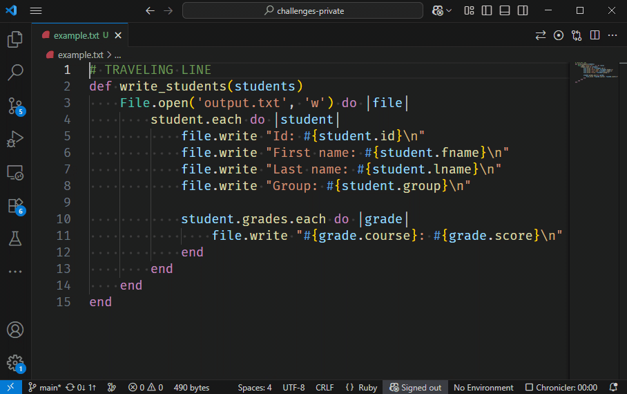

# Moving Line Down

> ⭐ Makkelijk · ±5 min · **Wat heb je nodig:** VS Code om het uit te proberen

You can rearrange lines easily.
What keybinding allows you to move a line downwards?
For some languages, it will automatically adjust the indentation, as shown below.

